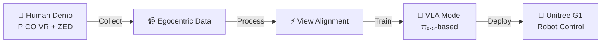
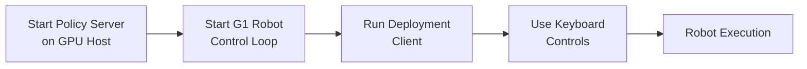

# EgoHumanoid

<div align="center">

[](https://arxiv.org/abs/2602.10106)
[](https://opendrivelab.com/EgoHumanoid/)
[](LICENSE)

</div>

<p align="center">
  <strong>🤖 The first framework enabling humanoid loco-manipulation with egocentric human demonstrations.</strong>
</p>

Human demonstrations offer rich environmental diversity and scale naturally, making them an appealing alternative to robot teleoperation. We present EGOHUMANOID, the first framework to co-train a vision-language-action policy using abundant egocentric human demonstrations together with a limited amount of robot data.

To bridge the embodiment gap, we introduce a systematic alignment pipeline with two key components: view alignment reduces visual discrepancies; action alignment maps human motions into a unified action space for humanoid control.

Extensive real-world experiments demonstrate that incorporating robot-free egocentric data significantly outperforms robot-only baselines by 51%, particularly in unseen environments.


---

## Table of Contents

- [📖 Overview](#overview)
- [🛠️ Hardware Setup](#hardware-setup)
  - [🤖 Robot Data Collection Hardware](#robot-data-collection-hardware)
  - [👤 Human Data Collection Hardware](#human-data-collection-hardware)
- [💻 Environment Setup](#environment-setup)
  - [📋 Prerequisites](#prerequisites)
  - [Installation](#installation)
- [🎥 Data Collection](#data-collection)
  - [Robot Data Collection](#robot-data-collection)
  - [Human Data Collection](#human-data-collection)
- [⚡ Data Processing](#data-processing)
  - [Human Data Pipeline](#human-data-pipeline)
  - [Robot Data Pipeline](#robot-data-pipeline)
  - [View Alignment](#view-alignment)
  - [Convert to LeRobot Format](#convert-to-lerobot-format)
- [🤖 Model Training](#model-training)
  - [Compute Normalization Statistics](#compute-normalization-statistics)
  - [Sample Dataset](#sample-dataset)
  - [Run Training](#run-training)
- [🚀 Deployment](#deployment)
  - [Policy Server](#policy-server)
  - [🎮 Robot Inference](#robot-inference)
- [📊 Requirements Summary](#requirements-summary)
- [📝 Citation](#citation)

**📚 Detailed Documentation:**
- [Robot Data Collection Guide →](data_collection/robot_data/README.md)
- [Human Data Collection Guide →](data_collection/human_data/README.md)
- [Data Processing Pipeline →](data_alignment/human_data_process/README.md)
- [View Alignment →](data_alignment/view_alignment/README.md)

---

<a id="overview"></a>

## 📖 Overview

<div align="center">



</div>

EgoHumanoid consists of **four main components**:

<table>
<tr>
<td width="25%" align="center">
<h4>1️⃣ Data Collection</h4>
Collect synchronized multi-modal data from both humanoid robots (Unitree G1) and human demonstrators (PICO VR + ZED Mini)
</td>
<td width="25%" align="center">
<h4>2️⃣ Data Processing</h4>
Process, align, and retarget human demonstrations to robot action space
</td>
<td width="25%" align="center">
<h4>3️⃣ Model Training</h4>
Fine-tune vision-language-action models π₀.₅ on the processed datasets
</td>
<td width="25%" align="center">
<h4>4️⃣ Deployment</h4>
Deploy trained policies on real humanoid robots with real-time inference
</td>
</tr>
</table>


---

<a id="hardware-setup"></a>

## 🛠️ Hardware Setup

<table>
<tr valign="top">
<td width="50%">

<a id="robot-data-collection-hardware"></a>

### 🤖 Robot Data Collection Hardware

**Required:**
- ✅ **Unitree G1 Humanoid Robot** with dex3-1 hands
- ✅ **Workstation PC**
  - Ubuntu 22.04
  - NVIDIA GPU (RTX 4090+)
  - Docker + NVIDIA Container Toolkit
- ✅ **ZED Mini Camera** (mounted on robot head)
- ✅ **Network Setup**
  - Static IP: `192.168.123.222`
  - Subnet: `255.255.255.0`

- ✅ PICO VR Headset (for teleoperation)

</td>
<td width="50%">

<a id="human-data-collection-hardware"></a>

### 👤 Human Data Collection Hardware

**Required:**
- ✅ **PICO VR Headset** (5 trackers for full-body tracking)
- ✅ **ZED Mini Camera** (mounted on headset)
- ✅ **Workstation PC**
  - Ubuntu 22.04/24.04
  - USB 3.0 ports
  - Network connection

</td>
</tr>
</table>

**Setup Requirements:**

- 📡 PICO and PC on same network
- 🎯 Full-body tracking activated
- 🔌 ZED Mini via USB 3.0

> [!NOTE]
> We use **ZED Mini** instead of **ZED X Mini** (as in the paper) for easier accessibility and setup.

---

<a id="environment-setup"></a>

## 💻 Environment Setup

<a id="prerequisites"></a>

### 📋 Prerequisites

<table>
<tr>
<td align="center"><b>🖥️ OS</b></td>
<td>Ubuntu 22.04 (tested and recommended)</td>
</tr>
<tr>
<td align="center"><b>🐍 Python</b></td>
<td>3.11+</td>
</tr>
<tr>
<td align="center"><b>🎮 GPU</b></td>
<td>
  • ≥ 8 GB VRAM (inference)<br>
  • ≥ 22.5 GB VRAM (fine-tuning with LoRA)<br>
  • ≥ 70 GB VRAM (full fine-tuning)
</td>
</tr>
</table>


### Installation

1. **Clone the repository with submodules:**

```bash
git clone --recurse-submodules https://github.com/OpenDriveLab/EgoHumanoid.git
cd EgoHumanoid
```

2. **Install uv package manager:**

```bash
# See https://docs.astral.sh/uv/getting-started/installation/
curl -LsSf https://astral.sh/uv/install.sh | sh
```

3. **Set up Python environment:**

```bash
# Create environment and install dependencies
GIT_LFS_SKIP_SMUDGE=1 uv sync
GIT_LFS_SKIP_SMUDGE=1 uv pip install -e .
```

4. **Set up GR00T WholeBodyControl for robot control (for robot data collection only):**

```bash
# Clone GR00T WholeBodyControl
cd data_collection/robot_data
git clone https://github.com/NVlabs/GR00T-WholeBodyControl.git
cd GR00T-WholeBodyControl/decoupled_wbc

# Copy teleoperation scripts
cp -r ../../teleop/ control/main/teleop

# Set up Docker environment
# Modify docker/run_docker.sh to mount src/openpi directory
# See data_collection/robot_data/README.md for detailed setup instructions

# Install and start Docker container
./docker/run_docker.sh --install --root
```

5. **Install ZED SDK (for data collection/processing):**

Follow the [ZED SDK installation guide](https://www.stereolabs.com/docs/installation) for your platform, then install the Python API:

```bash
python /usr/local/zed/get_python_api.py
```

6. **Install PICO SDK (for human data collection):**

Follow the [XR Robotics guidelines](https://github.com/XR-Robotics) to set up the PICO SDK and XRoboToolkit-PC-Service.

---

<a id="data-collection"></a>

## 🎥 Data Collection

For detailed hardware setup and collection procedures, see:
- [Robot Data Collection Guide](data_collection/robot_data/README.md)
- [Human Data Collection Guide](data_collection/human_data/README.md)
- [Hardware Installation](data_collection/human_data/install.md)

### Robot Data Collection

Robot data collection uses the Unitree G1 humanoid with teleoperation control and synchronized camera recording.

**1. Set up Docker environment:**

```bash
cd data_collection/robot_data/GR00T-WholeBodyControl/decoupled_wbc

# Modify docker/run_docker.sh to mount src/openpi directory
# See data_collection/robot_data/README.md for details

# Install and start Docker container
./docker/run_docker.sh --install --root
./docker/run_docker.sh --root
```

**2. Inside Docker container, run G1 control:**

```bash
# For real robot (ensure network is configured)
python decoupled_wbc/control/main/teleop/run_g1_control_loop.py --interface real --control-frequency 50 --with_hands
```

**3. In a separate terminal, run teleoperation:**

```bash
python decoupled_wbc/control/main/teleop/run_teleop_policy_loop.py --body-control-device pico --hand_control_device=pico --enable_real_device
```

**4. Start data collection:**

```bash
python decoupled_wbc/control/main/teleop/zed_mini_run_g1_data_exporter.py --dataset-name <task_name> --visualize
```

**Controller Bindings:**
- `Menu + Left Trigger`: Toggle lower-body policy
- `Menu + Right Trigger`: Toggle upper-body policy
- `Left Stick`: X/Y translation
- `Right Stick`: Yaw rotation
- `L/R Triggers`: Control hand grippers
- `A Button`: Start collecting episode
- `B Button`: Discard episode

**Output:**
- `data_collection/<task_name>/episode_*.hdf5` - Robot state, actions, and navigation commands
- `data_collection/<task_name>/episode_*.svo2` - ZED camera recordings

See [data_collection/robot_data/README.md](data_collection/robot_data/README.md) for detailed instructions.

### Human Data Collection

Human data collection captures synchronized full-body motion and binocular camera views.

**1. Set up data collection environment:**

```bash
# Create conda environment
conda create -n humandata python=3.11
conda activate humandata

# Install dependencies
pip install -r data_collection/human_data/requirements.txt
```

**2. Start data collection:**

```bash
cd data_collection/human_data

# Basic collection
python scripts/human_data_collection.py --name <dataset_name>

# With ZED camera preview
python scripts/human_data_collection.py --name <dataset_name> --visualize-zed

# Specify save directory
python scripts/human_data_collection.py --data-dir <save_dir> --name <dataset_name>
```

**3. Collection workflow:**

1. System initializes (PICO SDK + ZED Mini + MeshCat visualization)
2. Open browser at `http://localhost:7000/static/` to view 3D skeleton
3. Enter episode index (e.g., 0, 1, 2...)
4. Perform demonstration
5. Press **Space** to finish episode
6. Data is saved automatically
7. Continue to next episode or press **Ctrl+C** to exit

**Output:**
- `<data_dir>/<dataset_name>/episode_*.hdf5` - Body pose, hand pose, controller pose, timestamps
- `<data_dir>/<dataset_name>/episode_*.svo2` - ZED Mini video with depth

See [data_collection/human_data/README.md](data_collection/human_data/README.md) for detailed instructions.

---

<a id="data-processing"></a>

## ⚡ Data Processing

For detailed pipeline documentation, see:
- [Human Data Processing Pipeline](data_alignment/human_data_process/README.md)
- [View Alignment Documentation](data_alignment/view_alignment/README.md)

### Human Data Pipeline

The human data processing pipeline transforms raw VR recordings into robot-compatible datasets.

**Run the full pipeline:**

```bash
cd data_alignment/human_data_process

./run_human_data_pipeline.sh \
  --input_dir /path/to/raw_data \
  --output_dir /path/to/intermediate \
  --final-output-dir /path/to/final \
  --file all
```

**Pipeline stages:**

1. **Reorder Episodes**: Sort chronologically and renumber
2. **Navigation Pipeline**: Generate velocity commands from body pose
3. **Downsample**: Reduce frequency and discretize commands
4. **Merge Camera**: Integrate ZED camera frames
5. **Hand Status**: Compute binary hand open/close status

**Advanced usage:**

```bash
# Skip stages
./run_human_data_pipeline.sh \
  --input_dir /path/to/raw \
  --output_dir /path/to/processed \
  --final-output-dir /path/to/final \
  --skip-reorder \
  --skip-merge

# Generate validation plots
./run_human_data_pipeline.sh \
  --input_dir /path/to/raw \
  --output_dir /path/to/processed \
  --final-output-dir /path/to/final \
  --with-png

# Dry run (preview commands)
./run_human_data_pipeline.sh \
  --input_dir /path/to/raw \
  --output_dir /path/to/processed \
  --final-output-dir /path/to/final \
  --dry-run
```

See [data_alignment/human_data_process/README.md](data_alignment/human_data_process/README.md) for detailed pipeline documentation.

### Robot Data Pipeline

Process robot demonstration data:

```bash
cd data_alignment/robot_data_process

python merge_data.py \
  --dataset-dir /path/to/robot/data \
  --output-dir /path/to/processed/output
```

### View Alignment

Transform egocentric camera viewpoints to match robot's perspective using depth-based warping and inpainting.

**Process single HDF5 file:**

```bash
cd data_alignment/view_alignment

python viewport_transform_batch_h5.py \
  --h5_file /path/to/input.h5 \
  --image_key "observation_image_left" \
  --trajectory "down" \
  --movement_distance 0.07 \
  --output_dir ./output
```

**Process directory (multi-GPU):**

```bash
python viewport_transform_batch_h5.py \
  --h5_dir /path/to/h5_directory \
  --batch_size 32 \
  --trajectory "down" \
  --movement_distance 0.07 \
  --num_gpus 4 \
  --output_dir /path/to/output
```

**Trajectory options:** `left`, `right`, `up`, `down`, `forward`, `backward`

See [data_alignment/view_alignment/README.md](data_alignment/view_alignment/README.md) for more details.

### Convert to LeRobot Format

Convert processed HDF5 datasets to LeRobot format for training:

```bash
cd data_alignment

# Single-threaded
python convert_to_lerobot.py \
  --src-path /path/to/processed/data \
  --output-path /path/to/lerobot/data \
  --repo-id my_dataset \
  --fps 20 \
  --task "task description"

# Multi-threaded (faster)
python convert_to_lerobot.py \
  --src-path /path/to/processed/data \
  --output-path /path/to/lerobot/data \
  --repo-id my_dataset \
  --num-workers 16 \
  --fps 20 \
  --task "task description"
```

---

<a id="model-training"></a>

## 🤖 Model Training

### Compute Normalization Statistics

Before training, compute normalization statistics for your dataset:

```bash
uv run python scripts/compute_norm_states_ultra_fast.py --config-name=norm_compute
```

### Sample Dataset

A small example dataset (~100 MB, collected on Unitree G1) is hosted on Hugging Face for quickly validating the training pipeline or running a smoke-test fine-tune:

🤗 **[OpenDriveLab/EgoHumanoid](https://huggingface.co/datasets/OpenDriveLab/EgoHumanoid)**

```bash
# Download the sample dataset
hf download OpenDriveLab/EgoHumanoid --repo-type=dataset --local-dir ./data
```

### Run Training

Train the model using the computed normalization statistics:

```bash
# Set XLA memory fraction for better GPU utilization
XLA_PYTHON_CLIENT_MEM_FRACTION=0.9 uv run scripts/train.py <config_name> --exp_name=<experiment_name>
```

**Examples:**

```bash
# Train on your custom dataset
XLA_PYTHON_CLIENT_MEM_FRACTION=0.9 uv run scripts/train.py pi05_g1_custom --exp_name=my_experiment

# Multi-GPU training with FSDP
XLA_PYTHON_CLIENT_MEM_FRACTION=0.9 uv run scripts/train.py pi05_g1_custom --exp_name=my_experiment --fsdp-devices 4
```

Checkpoints are saved to `checkpoints/<config_name>/<exp_name>/` during training. Training progress is logged to the console and Weights & Biases.

---

<a id="deployment"></a>

## 🚀 Deployment

### Policy Server

Start a policy server for remote inference:

```bash
# Use a trained checkpoint
uv run scripts/serve_policy.py policy:checkpoint \
  --policy.config=<config_name> \
  --policy.dir=checkpoints/<config_name>/<exp_name>/<iteration>
```

The server will listen on port 8000 by default.

<a id="robot-inference"></a>

### 🎮 Robot Inference

The deployment client connects to the OpenPI policy server via websocket for action inference and controls the G1 robot via the GR00T WBC framework.

**On the robot/client side:**

```bash
# Inside the GR00T Docker container
cd /root/Projects/openpi

# Run the deployment client
python scripts/deploy.py --host <server_ip> --port 8000
```

**🎛️ Keyboard Controls:**

| Key | Action |
|:---:|:-------|
| `]` | ▶️ Activate WBC policy / Exit silent mode |
| `p` | 🎯 Enter preparation phase (move to initial pose) |
| `c` | 🖐️ Toggle left hand open/close (right hand stays open) |
| `l` | ⏯️ Start/pause inference loop |
| `[` | 🔇 Enter silent mode (slowly return to initial pose) |
| `o` | 🛑 Deactivate policy (emergency stop) |
| `Ctrl+C` | ❌ Exit program |

**📋 Workflow:**



**Example Python API:**

```python
from openpi.training import config as _config
from openpi.policies import policy_config

# Load policy
config = _config.get_config("pi05_g1_custom")
checkpoint_dir = "checkpoints/pi05_g1_custom/exp1/100000"
policy = policy_config.create_trained_policy(config, checkpoint_dir)

# Run inference
observation = {
    "observation/exterior_image_1_left": camera_left_image,
    "observation/wrist_image_left": wrist_image,
    "observation/state": joint_positions,
    "prompt": "pick up the object"
}
action_chunk = policy.infer(observation)["actions"]

# Execute on robot
robot.execute_action(action_chunk[0])
```

For detailed deployment instructions including camera setup, robot initialization, and troubleshooting, see the comments in `scripts/deploy.py`.

---

<a id="requirements-summary"></a>

## 📊 Requirements Summary

<div align="center">

| 💻 Component | 🎮 GPU Memory | 🔧 Example Hardware |
|:------------|:-------------|:-------------------|
| **Inference** | > 8 GB VRAM | RTX 4090 |
| **Fine-tuning (LoRA)** | > 22.5 GB VRAM | RTX 4090 |
| **Fine-tuning (Full)** | > 70 GB VRAM | A100 80GB / H100 |
| **Robot Control** | N/A | Ubuntu 22.04 PC |
| **Human Data Collection** | N/A | Ubuntu 22.04 + USB 3.0 |

</div>

---

<a id="citation"></a>

## 📝 Citation

If you find EgoHumanoid useful in your research, please consider citing:

```bibtex
@article{shi2026egohumanoid,
    title={EgoHumanoid: Unlocking In-the-Wild Loco-Manipulation with Robot-Free Egocentric Demonstration},
    author={Shi, Modi and Peng, Shijia and Chen, Jin and Jiang, Haoran and Li, Yinghui and Huang, Di and Luo, Ping and Li, Hongyang and Chen, Li},
    journal={arXiv preprint arXiv:2602.10106},
    year={2026}
}
```

<div align="center">

**⭐ If you find this project helpful, please consider giving it a star! ⭐**

</div>

---

## 📜 License

This project is licensed under the **Apache 2.0 License**.

The OpenPI models and code are provided by [Physical Intelligence](https://www.physicalintelligence.company/) under the Apache 2.0 License.

---

## 🙏 Acknowledgments

We sincerely thank the following projects and teams:

<table align="center">
<tr>
<td align="center" width="25%">
<a href="https://www.physicalintelligence.company/">

</a><br>
Vision-language-action models
</td>
<td align="center" width="25%">
<a href="https://github.com/NVlabs/GR00T-WholeBodyControl">

</a><br>
Humanoid control framework
</td>
<td align="center" width="25%">
<a href="https://github.com/XR-Robotics">

</a><br>
PICO VR integration
</td>
<td align="center" width="25%">
<a href="https://www.stereolabs.com/">

</a><br>
ZED camera SDK
</td>
</tr>
</table>
